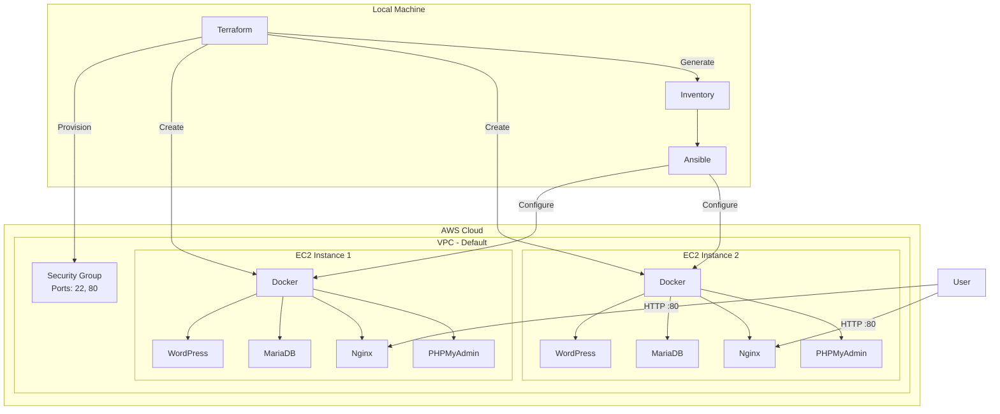

# AWS-Terraform-Ansible

<p align="center">
  
  
  
</p>

<p align="center">
  <i>Infrastructure as Code: Automated WordPress deployment on AWS using Terraform and Ansible</i>
</p>

---

## Table of Contents
- [About](#about)
- [Infrastructure Diagram](#infrastructure-diagram)
- [Content Structure](#content-structure)
- [Prerequisites](#prerequisites)
- [Quick Start](#quick-start)
- [Configuration](#configuration)
- [Usage Guide](#usage-guide)
- [Troubleshooting](#troubleshooting)

## About

This project automatically deploys a complete WordPress infrastructure on AWS by combining:
- **Terraform** for cloud infrastructure provisioning
- **Ansible** for server configuration management
- **Docker** for service containerization

### Deployed Stack

| Service | Description |
|---------|-------------|
| WordPress | Containerized CMS |
| MariaDB | Database |
| Nginx | Reverse proxy |
| PHPMyAdmin | DB interface |
| WP-CLI | WordPress CLI management |

### Automated Workflow

```
terraform apply → EC2 created → Inventory generated → SSH ready → Ansible triggered → Docker installed → WordPress UP
```

## Infrastructure Diagram



## Content Structure

```
AWS-Terraform-Ansible/
├── terraform/
│   ├── main.tf              # AWS resources (EC2, SG, null_resource)
│   ├── variables.tf         # Terraform variables
│   ├── outputs.tf           # Outputs (public IPs)
│   └── inventory.tpl        # Ansible inventory template
├── ansible/
│   ├── inventory/
│   │   ├── group_vars/
│   │   │   └── all.yml      # Global Ansible variables
│   │   └── aws.yml          # Inventory generated by Terraform
│   └── playbooks/
│       ├── templates/       # Jinja2 templates (docker-compose, nginx)
│       ├── 01-docker-installation.yml
│       └── 02-deploy-wordpress.yml
└── README.md
```

## Prerequisites

### Required Tools

| Tool | Version | Installation |
|------|---------|--------------|
| Terraform | >= 1.0 | [terraform.io](https://terraform.io) |
| Ansible | >= 2.9 | `pip install ansible` |
| AWS CLI | >= 2.0 | [aws.amazon.com/cli](https://aws.amazon.com/cli/) |

### AWS Configuration

```bash
# Configure credentials
aws configure

# Existing SSH key
ls ~/.ssh/aws  # Private key
# The "aws" key pair must exist on AWS
```

### Required Ansible Collection

```bash
ansible-galaxy collection install community.docker
```

## Quick Start

### Full Deployment (one-liner)

```bash
cd terraform && terraform init && terraform apply -auto-approve
```

### Step-by-step Deployment

```bash
# 1. Initialize Terraform
cd terraform
terraform init

# 2. Preview changes
terraform plan

# 3. Apply (creates EC2 + triggers Ansible automatically)
terraform apply
```

### Access Services

After deployment, retrieve the IPs:

```bash
terraform output
```

| Service | URL |
|---------|-----|
| WordPress | `http://<IP>/` |
| PHPMyAdmin | `http://<IP>/phpmyadmin/` |
| WP Admin | `http://<IP>/wp-admin/` |

## Configuration

### Terraform Variables

| Variable | Default | Description |
|----------|---------|-------------|
| `aws_region` | `us-east-1` | AWS region |
| `instance_type` | `t3.micro` | Instance type |
| `key_name` | `aws` | SSH key pair name |
| `project_name` | `AWS-Terraform-Ansible` | Resource tagging |

**Override**: create `terraform.tfvars`

```hcl
aws_region    = "eu-west-1"
instance_type = "t2.micro"  # Free tier
```

### Ansible Variables

File: `ansible/inventory/group_vars/all.yml`

| Variable | Description |
|----------|-------------|
| `wp_admin_user` | WordPress admin |
| `wp_admin_password` | Admin password |
| `wp_site_title` | Site title |
| `mysql_root_password` | MariaDB root |

## Usage Guide

### Run Ansible Only

```bash
cd ansible
ansible-playbook -i inventory/aws.yml playbooks/01-docker-installation.yml
ansible-playbook -i inventory/aws.yml playbooks/02-deploy-wordpress.yml
```

### Destroy Infrastructure

```bash
cd terraform
terraform destroy
```

### SSH to Instance

```bash
ssh -i ~/.ssh/aws ubuntu@<PUBLIC_IP>
```

### Check Containers

```bash
ssh -i ~/.ssh/aws ubuntu@<IP> "docker ps"
```

## Troubleshooting

### SSH Timeout During Terraform

The `null_resource.wait_ssh` waits for SSH to be ready. If timeout occurs:
- Check Security Group (port 22 open)
- Verify SSH key matches AWS key pair

### Ansible Fails

```bash
# Test connection
ansible -i ansible/inventory/aws.yml all -m ping

# Verbose mode
ansible-playbook -i inventory/aws.yml playbooks/01-docker-installation.yml -vvv
```

### WordPress Unreachable

```bash
# Check containers
docker ps -a
docker logs wordpress
docker logs nginx
```

---

**Last Updated**: 2025-01-21
**Version**: 1.0
